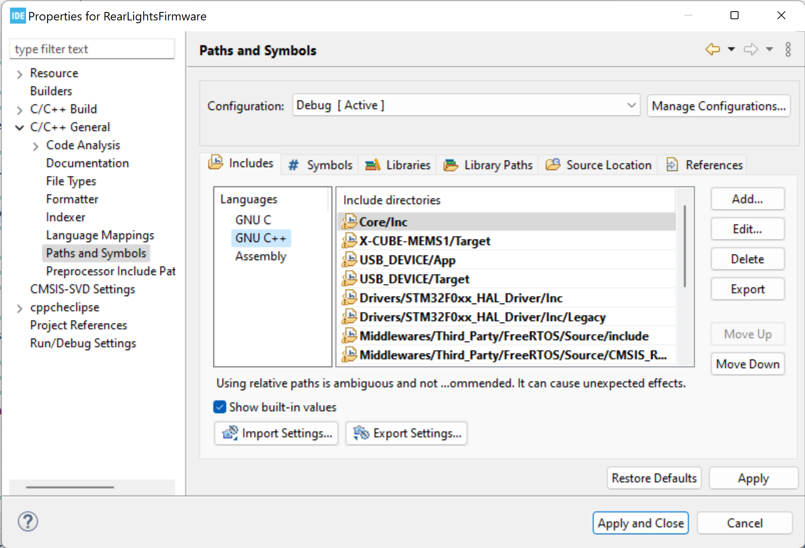
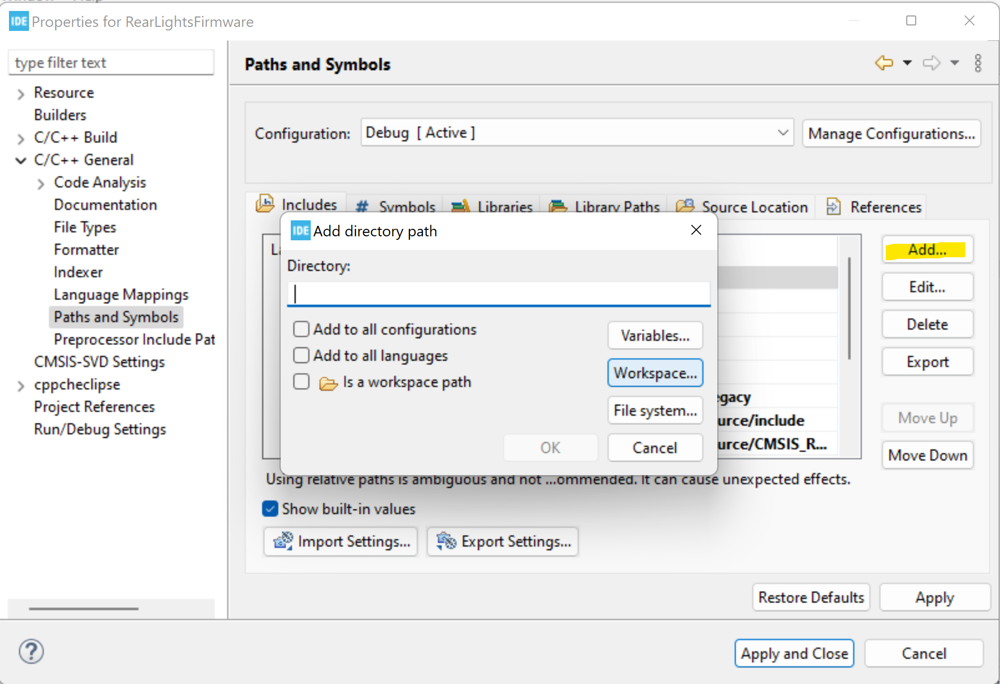
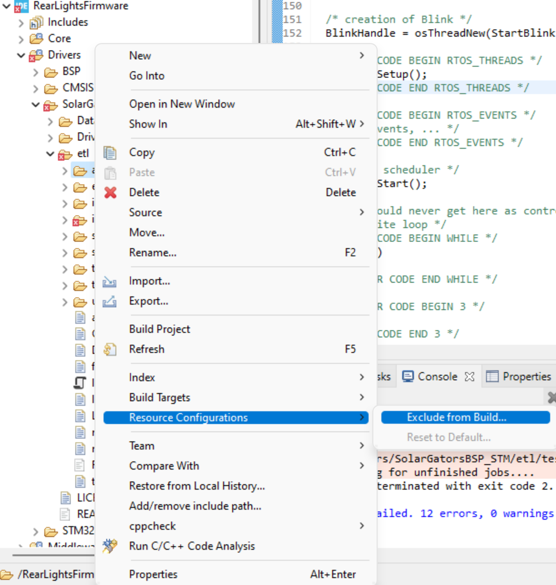
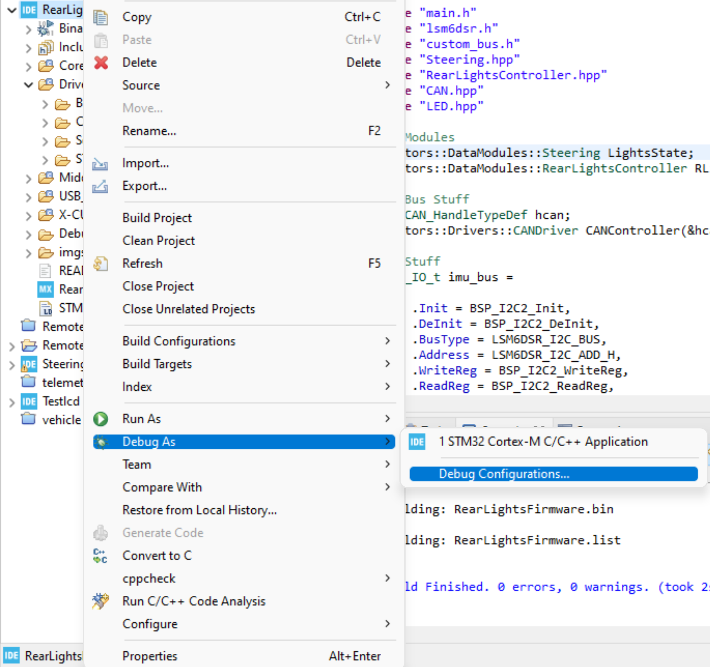

# Rear Lights Firmware
## Getting started
**Please make sure you are using STMCUBE IDE version 1.8.0**
1. Clone this repository with `git clone https://github.com/John-Carr/RearLightsFirmware.git --recursive` 
to ensure you clone the submodules.
2. Import this project into STM Cube IDE
3. Add the necessary include paths.
    * Go to File->Properties->C/C++ General->Paths and Symbols
    
    * Under Languages select GNU C++
    * Select Add and then workspace and add the following Directories
        * RearLightsFirmware/Drivers/SolarGatorsBSP_STM/DataModules/inc
        * RearLightsFirmware/Drivers/SolarGatorsBSP_STM/Drivers/inc
        * RearLightsFirmware/Drivers/SolarGatorsBSP_STM/etl/include
    
    * Exclude the following directories and files from the both the release and 
        debug builds 
        * RearLightsFirmware/Drivers/SolarGatorsBSP_STM/etl/arduino
        * RearLightsFirmware/Drivers/SolarGatorsBSP_STM/etl/examples
        * RearLightsFirmware/Drivers/SolarGatorsBSP_STM/etl/test
        * RearLightsFirmware/Drivers/SolarGatorsBSP_STM/Drivers/HY28b.hpp
            * For this file you'll need to go to properties and exclude it there
        * RearLightsFirmware/Drivers/SolarGatorsBSP_STM/Drivers/HY28b.cpp
        * RearLightsFirmware/Drivers/SolarGatorsBSP_STM/Drivers/RFD900x.hpp
            * For this file you'll need to go to properties and exclude it there
        * RearLightsFirmware/Drivers/SolarGatorsBSP_STM/Drivers/RFD900x.cpp
    
4. Make sure the project builds without errors
## Programming the board
### STM Programmer
TODO
### JLink Programmer
Go to debug configuration

Ensure that you have the JLink selected as the debug probe, swd selected as the 
interface, and STM32F072RB as the target. 

Ensure that you can program the board